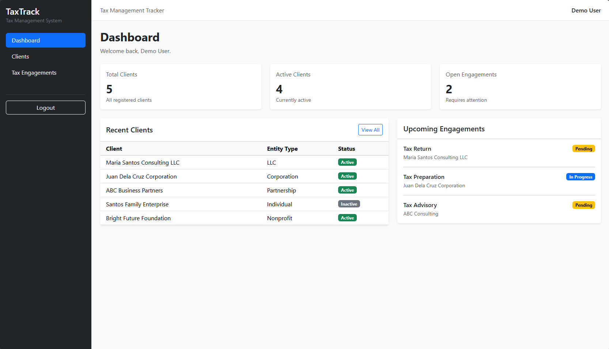
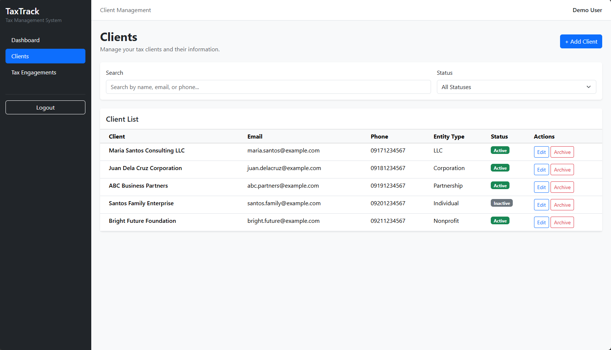
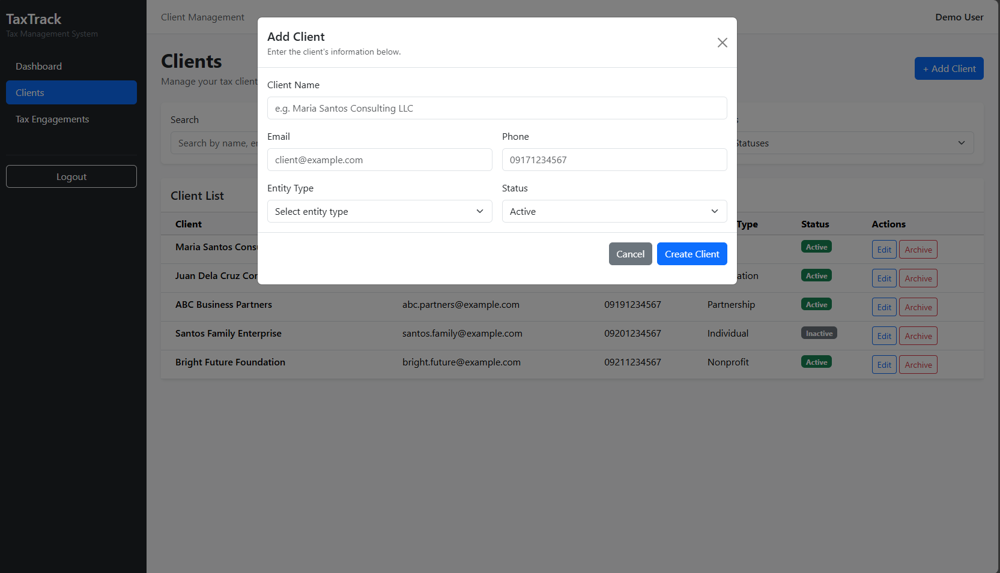
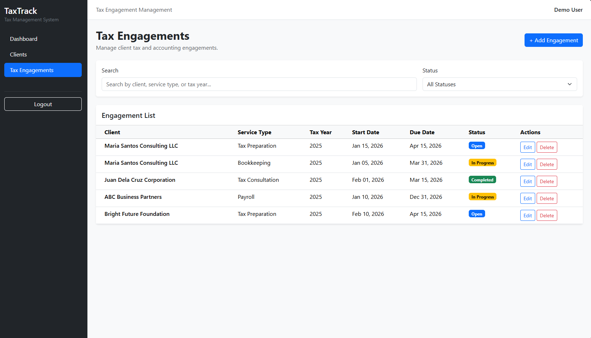
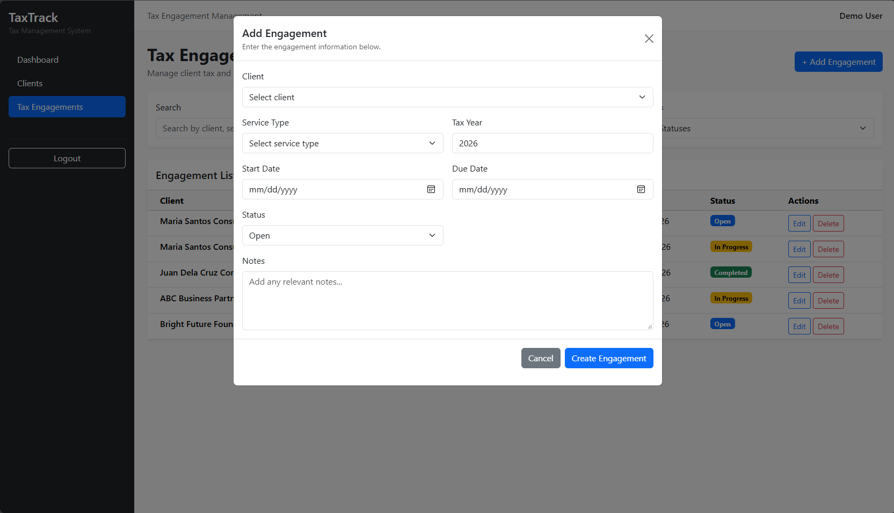

# TaxTrack

A web-based tax management system for managing clients and tracking tax engagements.

TaxTrack is a personal project built to strengthen my backend development skills using Laravel and to practice building a business-oriented application with database-driven workflows, RESTful APIs, AJAX interactions, and CRUD operations.

> **Project Status:** In Development

---

## Overview

TaxTrack is designed to help organize tax-related client information and engagements in one centralized system.

The application is being developed around two main areas:

- Client Management
- Tax Engagement Management

The Client Management module is currently implemented, while the Tax Engagement Management module is still under development.

---

## Screenshots

### Dashboard



### Client Management



### Add Client



### Edit Client



### Tax Engagements — In Progress



---

## Current Features

### Client Management

The Client Management module currently supports:

- Create client records
- View client records
- Edit client records
- Archive client records
- Search clients
- Filter clients by status
- Store client contact information
- Store client entity type
- Manage client status
- Soft delete support

### Authentication

- User login
- User logout
- Session-based authentication
- Protected application routes

### Dashboard

The dashboard is being developed to provide an overview of:

- Total clients
- Active clients
- Tax engagements
- Recent clients
- Upcoming engagements

Some dashboard functionality is dependent on the completion of the Tax Engagement module.

---

## In Progress

### Tax Engagement Management

The Tax Engagement module is currently under development.

Planned functionality includes:

- Create tax engagements
- Associate engagements with clients
- Track service type
- Track tax year
- Set start and due dates
- Track engagement status
- Add engagement notes
- Edit engagements
- Archive/delete engagements
- Search and filter engagements
- Display upcoming engagements on the dashboard

---

## Tech Stack

| Technology | Purpose |
|------------|---------|
| PHP | Backend programming language |
| Laravel | Web application framework |
| MySQL | Relational database |
| Eloquent ORM | Database interaction |
| Blade | Server-side templating |
| Bootstrap | UI framework |
| jQuery | AJAX and frontend interactions |
| Docker | Development environment |
| Git | Version control |

---

## Application Architecture

The application follows Laravel's MVC architecture.

```text
TaxTrack
│
├── Authentication
│
├── Client Management
│   └── Clients
│
├── Tax Engagement Management
│   └── Engagements
│
└── Dashboard
